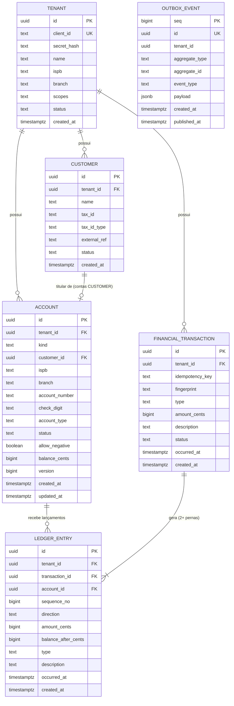

# Modelo de Dados — Wallet Core

Este documento descreve as entidades, relacionamentos e regras de integridade do schema PostgreSQL definido em `wallet-adapter-out-persistence/src/main/resources/db/migration/V1__core_schema.sql`. É a fonte de verdade do banco; qualquer divergência entre este documento e o SQL, o SQL vence.

## 1. Visão geral

O modelo tem seis tabelas, organizadas em três grupos:

| Grupo | Tabelas | Papel |
|---|---|---|
| **Identidade** | `tenant`, `customer` | Quem é o cliente white label e quem são os clientes finais dele |
| **Saldo e ledger** | `account`, `financial_transaction`, `ledger_entry` | O núcleo financeiro: contas, transações e os lançamentos contábeis imutáveis |
| **Integração** | `outbox_event` | Publicação assíncrona e confiável de eventos de domínio |

## 2. Diagrama de entidade-relacionamento

`OUTBOX_EVENT` não tem seta no diagrama porque não carrega uma foreign key formal: `tenant_id` e `aggregate_id` nela são apenas texto/uuid copiados no momento da gravação (ver seção 8).

## 3. Entidades

### 3.1 `tenant` — o cliente white label

Representa cada empresa que usa a plataforma para oferecer contas de pagamento aos próprios clientes.

| Coluna | Tipo | Regra |
|---|---|---|
| `id` | uuid | PK |
| `client_id` | text | único; identificador usado no login HTTP Basic |
| `secret_hash` | text | hash bcrypt do client secret — o segredo em texto puro nunca é armazenado |
| `name` | text | razão social / nome comercial |
| `ispb` | text | 8 dígitos — identifica o participante no SPI/PIX |
| `branch` | text | 4 dígitos — agência usada nas contas emitidas por este tenant |
| `scopes` | text | lista de escopos OAuth separados por espaço (ex.: `accounts:read ledger:write`) |
| `status` | text | `ACTIVE` \| `SUSPENDED` |
| `created_at` | timestamptz | |

`tenant` é a **raiz da hierarquia** e a única tabela sem Row Level Security — faz sentido, já que é ela que define o que é um tenant. Todas as demais tabelas de negócio carregam `tenant_id` e são filtradas por ele.

### 3.2 `customer` — o cliente final

O correntista: a pessoa física ou jurídica dona da carteira digital.

| Coluna | Tipo | Regra |
|---|---|---|
| `id` | uuid | PK |
| `tenant_id` | uuid | FK → `tenant.id` |
| `name` | text | |
| `tax_id` | text | CPF (11 dígitos) ou CNPJ (14 caracteres, aceita o formato alfanumérico) |
| `tax_id_type` | text | `CPF` \| `CNPJ` |
| `external_ref` | text | identificador opcional do sistema do tenant (nullable) |
| `status` | text | `ACTIVE` \| `BLOCKED` |
| `created_at` | timestamptz | |

**Restrições únicas:**
- `UNIQUE (tenant_id, tax_id)` — o mesmo CPF/CNPJ não pode ser onboardado duas vezes no mesmo tenant (mas pode existir em tenants diferentes).
- `UNIQUE (tenant_id, external_ref) WHERE external_ref IS NOT NULL` — índice parcial, já que `external_ref` é opcional.

Um `customer` tem no máximo uma `account` do tipo `CUSTOMER` neste V1 (o caso de uso de onboarding abre exatamente uma conta por cliente). O schema não impõe isso via constraint — é uma regra da camada de aplicação, não do banco.

### 3.3 `account` — contas do ledger

A tabela mais importante do modelo. Representa **dois tipos de conta na mesma tabela** (herança por coluna discriminadora `kind`):

| `kind` | O que é | `customer_id` | Campos de número (BCB) | `allow_negative` |
|---|---|---|---|---|
| `CUSTOMER` | Conta de pagamento (tipo `TRAN`) de um cliente final | obrigatório | obrigatórios | `false` (nunca fica negativa) |
| `SETTLEMENT` | Conta interna de contrapartida para depósitos/saques (existem várias por tenant — *shards*) | nulo | nulos | `true` (pode ficar negativa; é o "espelho" do dinheiro que entrou/saiu da plataforma) |

| Coluna | Tipo | Regra |
|---|---|---|
| `id` | uuid | PK |
| `tenant_id` | uuid | FK → `tenant.id` |
| `kind` | text | `CUSTOMER` \| `SETTLEMENT` |
| `customer_id` | uuid | FK → `customer.id`; obrigatório só para `CUSTOMER` |
| `ispb`, `branch`, `account_number`, `check_digit` | text | identificação bancária da conta; obrigatórios só para `CUSTOMER` |
| `account_type` | text | hoje só `TRAN` (conta de pagamento) |
| `status` | text | `ACTIVE` \| `BLOCKED` \| `CLOSED` |
| `allow_negative` | boolean | se `false`, o saldo nunca pode ficar abaixo de zero |
| `balance_cents` | bigint | **saldo atual, mantido como projeção** (ver seção 5) |
| `version` | bigint | sempre igual ao `sequence_no` do último lançamento desta conta — é o contador de "quantos eventos essa conta já sofreu" |
| `created_at`, `updated_at` | timestamptz | |

**Constraints de integridade (CHECK):**
- `account_shape`: garante que uma conta `CUSTOMER` sempre tem cliente e número bancário completos, e que uma `SETTLEMENT` nunca tem nenhum dos dois. Isso é o banco impedindo, estruturalmente, uma conta "pela metade".
- `account_non_negative`: `allow_negative OR balance_cents >= 0`. Esta é a **última linha de defesa** contra saldo negativo — mesmo que um bug no código de aplicação tente descontar mais do que existe, o `UPDATE` falha no banco.

**Índices:**
- `account_number_uk` (único, parcial): `(ispb, branch, account_number)` só para `kind = 'CUSTOMER'` — impede duas contas de clientes com o mesmo número bancário.
- `account_tenant_customer_idx`, `account_tenant_kind_idx`: aceleram as consultas mais comuns (contas de um cliente; contas de settlement de um tenant).

### 3.4 `financial_transaction` — cabeçalho da transação

Um registro por movimentação de dinheiro (depósito, saque ou transferência), independentemente de quantas contas ela afeta.

| Coluna | Tipo | Regra |
|---|---|---|
| `id` | uuid | PK |
| `tenant_id` | uuid | FK → `tenant.id` |
| `idempotency_key` | text | a chave enviada pelo cliente no header `Idempotency-Key` |
| `fingerprint` | text | hash SHA-256 dos parâmetros do pedido (conta, valor, tipo, descrição) |
| `type` | text | `DEPOSIT` \| `WITHDRAWAL` \| `TRANSFER`, ou um tipo Pix (migration `V4`, ADR-010): `PIX_IN` \| `PIX_OUT` \| `PIX_REFUND` \| `PIX_RETURN_IN` \| `PIX_RETURN_OUT` |
| `amount_cents` | bigint | valor da transação, sempre positivo |
| `description` | text | |
| `status` | text | hoje só existe `POSTED` (reservado para estender no futuro, ex. `REVERSED`) |
| `occurred_at` | timestamptz | quando a transação foi processada |
| `created_at` | timestamptz | quando a linha foi gravada (auditoria técnica) |

**`UNIQUE (tenant_id, idempotency_key)`** é a constraint que implementa idempotência: a aplicação faz `INSERT ... ON CONFLICT DO NOTHING` nessa chave antes de mexer em qualquer saldo. Se o `INSERT` não inserir nada, é porque a transação já existe — e a aplicação compara o `fingerprint` para decidir entre "replay" (mesmo pedido) e "conflito" (mesma chave, pedido diferente → HTTP 409).

Esta tabela é **append-only**: nenhuma role tem permissão de `UPDATE`/`DELETE`, reforçado por trigger (seção 6).

### 3.5 `ledger_entry` — os lançamentos contábeis (o coração do sistema)

Cada linha é um fato imutável: "a conta X recebeu um débito/crédito de Y centavos, ficando com saldo Z". É a fonte de verdade a partir da qual o saldo pode ser **totalmente reconstruído**.

| Coluna | Tipo | Regra |
|---|---|---|
| `id` | uuid | PK |
| `tenant_id` | uuid | FK → `tenant.id` |
| `transaction_id` | uuid | FK → `financial_transaction.id` |
| `account_id` | uuid | FK → `account.id` |
| `sequence_no` | bigint | posição deste lançamento na história **daquela conta** (1, 2, 3…) |
| `direction` | text | `DEBIT` \| `CREDIT` |
| `amount_cents` | bigint | sempre positivo (o sinal vem de `direction`, não do valor) |
| `balance_after_cents` | bigint | saldo da conta **logo após** este lançamento |
| `type` | text | copiado da transação (inclusive os tipos Pix) — desnormalizado de propósito, para consultar e filtrar o extrato sem precisar fazer join |
| `description` | text | copiado da transação |
| `counterparty_account_id` | uuid | FK → `account.id`, nullable. A conta da outra perna da mesma transação (adicionada na migration `V2`). Gravada para toda transação, mas **só exposta pela API quando `type = TRANSFER`** — para depósito/saque a contraparte é uma conta interna de settlement, que nunca pode ficar visível ao cliente (ver `EntryResponse.from`) |
| `occurred_at`, `created_at` | timestamptz | |

**`UNIQUE (account_id, sequence_no)`** é a constraint que garante a sequência **sem buracos** por conta — a base de tudo: o serviço de auditoria (`AuditLedgerService`) percorre os lançamentos de uma conta em ordem de `sequence_no` e recalcula o saldo passo a passo, comparando com `balance_after_cents` em cada um e com `account.balance_cents`/`account.version` no final.

Toda transação gera **no mínimo duas linhas** em `ledger_entry` (uma por perna/`Leg`), sempre com `Σ créditos = Σ débitos` — ver seção 5.

### 3.5.1 `pix_transaction_detail` — o detalhe de cada transação Pix

Adicionada na migration `V4` (ADR-010). Uma linha por transação `PIX_*`, gravada na **mesma transação de banco** que o lançamento, com o que o extrato precisa para mostrar o Pix sozinho: EndToEndId, contraparte e motivo. Append-only (mesmo trigger do ledger) e com a mesma política de RLS.

| Coluna | Tipo | Regra |
|---|---|---|
| `transaction_id` | uuid | PK, FK → `financial_transaction.id` |
| `tenant_id` | uuid | FK → `tenant.id` |
| `type` | text | o mesmo tipo `PIX_*` da transação, repetido para a unicidade e os filtros não precisarem de join |
| `end_to_end_id` | text | EndToEndId do Pix (estorno e devolução levam o do Pix original) |
| `return_id` | text | id da devolução (`RtrId`), só em `PIX_RETURN_*` |
| `related_transaction_id` | uuid | FK → `financial_transaction.id`: o Pix original, em `PIX_REFUND` e `PIX_RETURN_*` |
| `counterparty_name` | text | nome da contraparte (recebedor de um Pix enviado, pagador de um recebido) |
| `counterparty_tax_id_masked` | text | CPF/CNPJ **só mascarado** (`***7735`); o completo fica no banco `pix` |
| `counterparty_ispb`, `counterparty_branch`, `counterparty_account`, `counterparty_account_type` | text | conta da contraparte; agência e tipo são opcionais |
| `reason_code` | text | motivo do estorno ou da devolução (ex.: `AC03`, `MD06`) |
| `remittance_info` | text | mensagem do pagador |

Regras no banco:
- **`pix_transaction_detail_shape`**: `PIX_IN`/`PIX_OUT` não apontam para outra transação; `PIX_REFUND` aponta; `PIX_RETURN_*` apontam e têm `return_id`.
- **Índice único `(tenant_id, type, end_to_end_id, return_id) NULLS NOT DISTINCT`**: o mesmo Pix não é lançado duas vezes, qualquer que seja a `Idempotency-Key`.
- **Constraint trigger adiado `financial_transaction_pix_detail`**: no COMMIT, toda transação `PIX_*` precisa ter a sua linha aqui.

As regras que dependem de outras transações (estorno uma única vez, devoluções somadas até o valor original, estorno e devolução nunca no mesmo Pix) ficam no `MoveMoneyService`, serializadas por um advisory lock da transação original.

### 3.6 `outbox_event` — fila transacional de eventos

Implementa o padrão *transactional outbox*: o evento é gravado na **mesma transação** do fato que ele representa, então nunca existe uma situação de "salvei o dado mas esqueci de publicar o evento" (ou vice-versa).

| Coluna | Tipo | Regra |
|---|---|---|
| `seq` | bigint | PK, auto-incremento — define a ordem de publicação |
| `id` | uuid | identidade lógica do evento (idempotência do lado consumidor) |
| `tenant_id` | uuid | não é FK formal (ver nota abaixo) |
| `aggregate_type` | text | `"customer"` ou `"transaction"` |
| `aggregate_id` | text | id do cliente ou da transação, como string |
| `event_type` | text | ex.: `wallet.customer.onboarded.v1`, `wallet.transaction.posted.v1` |
| `payload` | jsonb | corpo do evento (sem CPF/CNPJ nem nome — ver seção 8) |
| `created_at` | timestamptz | |
| `published_at` | timestamptz | nulo enquanto pendente; preenchido pelo relay após publicar |

`outbox_event_pending_idx` é um índice parcial em `seq WHERE published_at IS NULL` — é o que o `OutboxRelay` usa para achar rapidamente o que ainda falta publicar, com `FOR UPDATE SKIP LOCKED` (múltiplas instâncias do relay podem rodar em paralelo sem disputar a mesma linha).

## 4. Relacionamentos (resumo)

| De | Para | Cardinalidade | Regra |
|---|---|---|---|
| `tenant` | `customer` | 1:N | um tenant tem muitos clientes |
| `tenant` | `account` | 1:N | um tenant tem muitas contas (de clientes + settlement) |
| `tenant` | `financial_transaction` | 1:N | um tenant tem muitas transações |
| `customer` | `account` | 1:0..1 (no V1) | um cliente tem no máximo uma conta `CUSTOMER`, imposto pela aplicação, não pelo schema |
| `account` | `ledger_entry` | 1:N | cada conta acumula um lançamento por transação da qual participa |
| `financial_transaction` | `ledger_entry` | 1:N (mínimo 2) | toda transação vira 2+ lançamentos balanceados |
| `financial_transaction` | `pix_transaction_detail` | 1:0..1 | exatamente 1 quando o tipo é `PIX_*`, nenhum nos demais |
| `financial_transaction` | `pix_transaction_detail` (`related_transaction_id`) | 1:N | um Pix original pode ter um estorno ou várias devoluções |

Não existe uma FK formal de `account` para `financial_transaction`, nem de `outbox_event` para as demais tabelas — essas ligações são feitas via `ledger_entry` (que referencia as duas) e via `aggregate_id`/`tenant_id` copiados como valor simples.

## 5. Como o saldo funciona (a peça central do modelo)

1. Toda movimentação é uma `LedgerTransaction` com **duas ou mais pernas (`Leg`)**, cada uma com uma direção e um valor, tal que a soma dos débitos seja igual à soma dos créditos.
   - **Depósito** = débito na conta `SETTLEMENT` + crédito na conta `CUSTOMER`.
   - **Saque** = débito na conta `CUSTOMER` + crédito na conta `SETTLEMENT`.
   - **Transferência** = débito na conta de origem + crédito na conta de destino (ambas `CUSTOMER`).
2. Para cada perna, a aplicação executa um único `UPDATE account SET balance_cents = balance_cents + delta, version = version + 1 WHERE ... AND (allow_negative OR balance_cents + delta >= 0) RETURNING balance_cents, version`. O PostgreSQL trava a linha durante essa instrução; é isso que impede duas movimentações simultâneas de "perderem" uma atualização uma da outra.
3. O `version` retornado vira o `sequence_no` do novo `ledger_entry` daquela conta — por isso a sequência nunca tem buracos.
4. Um trigger *deferred* (`ledger_entry_balanced`) confere, no `COMMIT`, que a soma dos créditos menos débitos de cada `transaction_id` é zero — uma segunda checagem, independente da aplicação.
5. Como consequência, **a soma de todos os saldos de um tenant (contas de clientes + contas de settlement) é sempre zero**: nenhuma movimentação cria ou destrói dinheiro, só desloca entre contas.

## 6. Imutabilidade do ledger

`ledger_entry` e `financial_transaction` têm triggers que bloqueiam `UPDATE`, `DELETE` e `TRUNCATE` — **mesmo para a role da aplicação**, que também não recebe o privilégio de `UPDATE`/`DELETE` nessas tabelas via `GRANT`. Corrigir um erro de lançamento nunca é feito editando a linha; é feito lançando uma nova transação de estorno (funcionalidade prevista, não implementada neste V1 — ver README).

## 7. Multi-tenancy (Row Level Security)

`customer`, `account`, `financial_transaction` e `ledger_entry` têm Row Level Security habilitado e **forçado** (`FORCE ROW LEVEL SECURITY`, que aplica a policy até para o dono da tabela). A policy compara `tenant_id` com a configuração de sessão `app.tenant_id`, que a aplicação define no início de cada transação a partir do `tenant_id` do JWT. Sem essa configuração, a policy não libera nenhuma linha — por padrão, "sem tenant" enxerga uma tabela vazia, não todos os dados.

`tenant` fica de fora do RLS porque é a raiz da hierarquia (não tem um "tenant do tenant" para filtrar por).

## 8. O que os eventos publicam (e o que não publicam)

Os dois eventos de domínio hoje são `CustomerOnboarded` e `TransactionPosted`. Os payloads carregam apenas identificadores (`UUID`), valores em centavos e metadados estruturais (agência, tipo de conta) — **nunca CPF/CNPJ nem nome do cliente**, por design, já que o outbox pode ser consumido por sistemas externos (fila, outro serviço) fora do perímetro de segurança do banco.

## 9. O que fica fora do V1 (e exigiria mudança de modelo)

- **Reversão/estorno de transação**: hoje não há tabela nem campo para isso; a forma correta seria uma nova `financial_transaction` do tipo `REVERSAL` referenciando a original, nunca alterando os lançamentos existentes.
- **Múltiplas contas por cliente**: o schema já permite (não há `UNIQUE (tenant_id, customer_id)` em `account`), mas o caso de uso de onboarding só abre uma.
- **Bloqueio/reserva de saldo (holds)**: exigiria uma tabela nova de reservas, sem tocar no ledger existente.
- **Particionamento do `ledger_entry` por tempo**: recomendado para volume alto; exige incluir a coluna de partição nas constraints únicas existentes.
